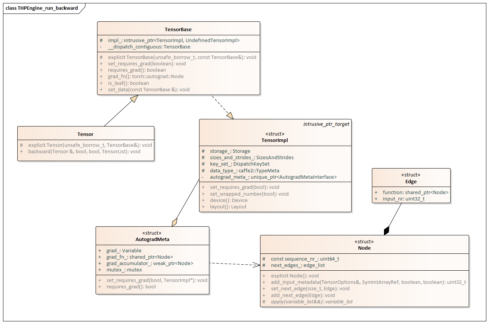

#	自动微分
我们知道，深度学习框架训练模型的基本流程是：

*	依据模型搭建计算图。
*	依据输入计算损失函数。
*	计算损失函数对模型参数的导数。
*	根据得出的导数，利用梯度下降法等方法来反向更新模型参数，让损失函数最小化

搭建计算图（依赖关系）和计算损失函数的过程，称为“正向传播”，这个是依据用户模型完成，本质上是用户自己处理。而依据损失函数求导的过程，称为"反向传播”，这个对于用户来说太繁重，所以各种深度学习框架都提供了自动求导功能。深度学习框架帮助我们解决的核心问题就是两个:
* 反向传播时的自动梯度计算和更新
* 使用 GPU 进行计算。

## 常见方法
我们首先看看微分的几种比较常用的方法：
*	手动求解法(Manual Differentiation) : 完全手动完成，依据链式法则解出梯度公式，带入数值，得到梯度。
*	数值微分法(Numerical Differentiation) ：利用导数的原始定义，直接求解微分值。
*	符号微分法(Symbolic Differentiation) : 利用求导规则对表达式进行自动计算，其计算结果是导函数的表达式而非具体的数值。即，先求解析解，然后转换为程序，再通过程序计算出函数的梯度。

自动微分法(Automatic Differentiation) ：介于数值微分和符号微分之间的方法，采用类似有向图的计算来求解微分值。
*	数值微分：一开始就直接代入数值近似求解。
*	符号微分：直接对代数表达式求解析解，最后才代入数值进行计算。
*	自动微分：首先对基本算子（函数）应用符号微分方法，其次带入数值进行计算，保留中间结果，最后通过链式求导法将中间结果应用于整个函数，这样可以做到完全向用户隐藏微分求解过程，也可以灵活于编程语言的循环结构、条件结构等结合起来。

自动微分的精髓在于它发现了微分计算的本质：微分计算就是一系列有限的可微算子的组合。

自动微分法被认为是对计算机程序进行非标准的解释。自动微分基于一个事实，即每一个计算机程序，不论它有多么复杂，都是在执行加减乘除这一系列基本算数运算，以及指数、对数、三角函数这类初等函数运算。于是自动微分先将符号微分法应用于最基本的算子，比如常数，幂函数，指数函数，对数函数，三角函数等，然后代入数值，保留中间结果，最后再通过链式求导法则应用于整个函数。

我们以如下为例，这是原始公式


自动微分以链式法则为基础，把公式中一些部分整理出来成为一些新变量，然后用这些新变量整体替换这个公式，于是得到：


然后把这些新变量作为节点，依据运算逻辑把公式整理出一张有向无环图（DAG）。即，原始函数建立计算图，数据正向传播，计算出中间节点xi，并记录计算图中的节点依赖关系。

因此，自动微分可以被认为是将一个复杂的数学运算过程分解为一系列简单的基本运算， 其中每一项基本运算都可以通过查表得出来。


## AutoGrad相关代码解读


### python

1. backward()  
函数定义于torch/tensor.py中，如下所示：
```py
def backward(
    self, gradient=None, retain_graph=None, create_graph=False, inputs=None
    ):
    if has_torch_function_unary(self):
        return handle_torch_function(
            Tensor.backward,
            (self,),
            self,
            gradient=gradient,
            retain_graph=retain_graph,
            create_graph=create_graph,
            inputs=inputs,
        )
    torch.autograd.backward(
        self, gradient, retain_graph, create_graph, inputs=inputs
)
```
 
上图中, 会对调用backward函数的对象进行类型判定,如果该类型不是Tensor且has_torchfunction(检查__torch_function_ overrides)返回true, 则进入handle_torchfunction,否则进入torch.autograd.backward(绝大多数情况).

2. torch.autograd.backward  
函数位于torch/autograd/__init__.py中,其定义如下:
```py
def backward(
    tensors: _TensorOrTensors,
    grad_tensors: Optional[_TensorOrTensors] = None,
    retain_graph: Optional[bool] = None,
    create_graph: bool = False,
    grad_variables: Optional[_TensorOrTensors] = None,
    inputs: Optional[_TensorOrTensorsOrGradEdge] = None,
) -> None:
    ...
    ...
    # calls in the traceback and some print out the last line
    Variable._execution_engine.run_backward(  # Calls into the C++ engine to run the backward pass
        tensors,
        grad_tensors_,
        retain_graph,
        create_graph,
        inputs,
        allow_unreachable=True,
        accumulate_grad=True,
    )  # Calls into the C++ engine to run the backward pass
```
该函数前段是进行一些参数的设置, 参数的意义注释中已经写得很明白, 最后调用Variable._execution_engine.run_backward进行实际的backward
 
3. Variable._execution_engine  
定义在torch/autograd/variable.py中, 具体代码如下:
```py
import torch
from torch._C import _ImperativeEngine as ImperativeEngine


__all__ = ["VariableMeta", "Variable"]


class VariableMeta(type):
    def __instancecheck__(cls, other):
        return isinstance(other, torch.Tensor)


class Variable(torch._C._LegacyVariableBase, metaclass=VariableMeta):  # type: ignore[misc]
    _execution_engine = ImperativeEngine()
```
可以看到, Variable.execution_engine实现就是torch._C中的ImperativeEngine的实现


## C++



### 基础类
PyTorch把计算都当作是一种有向无环图，或者说是计算图，但这是一种虚拟的图，代码中没有真实的数据结构。
* 计算图由节点（Node）和边（Edge）组成。
* 节点（Node）代表了运算操作。 
    + 一个节点通过边来获得 0 个或多个 Tensor，节点执行计算之后会产生 0 个或多个 Tensor.
    + 节点的成员变量 ***next_edges_*** 是一个 tuple 列表，此列表就代表本节点要输出到哪些其他 node。列表个数就是这个 grad_fn 的 Edge 数目，列表之中每一个 tuple 对应一条 Edge 信息，内容就是 (Edge.function, Edge.input_nr)。
```cpp
// torch/csrc/autograd/function.h
struct TORCH_API Node : std::enable_shared_from_this<Node> {
  . . .
  void set_next_edges(edge_list&& next_edges);
  . . .
  virtual variable_list apply(variable_list&& inputs) = 0;
  . . .
  edge_list next_edges_;
  . . .
};
```
* 边（Edge）就是运算操作之间的流向关系。 
  +	Edge.function ：表示此 Edge 需要输出到哪一个其他 Function。
  +	Edge.input_nr ：指定本 Edge 是 Function 的第几个输入。
*	使用张量（ Tensor） 表示数据，就是在节点间流动的数据，如果没有数据，计算图就没有任何意义。
```cpp
// torch/csrc/autograd/edge.h
struct Edge {
    . . .
  // The function this `Edge` points to.
  std::shared_ptr<Node> function;
  // The identifier of a particular input to the function.
  uint32_t input_nr;
};
```

ps：废弃类

Variable与Tensor的合并
在早期的PyTorch版本中，Variable与Tensor是不同的类，Variable用来保存需要计算梯度的Tensor，但Variable的实现并不美好：一方面Variable::Impl是Tensor的子类，而它的成员里又拥有一个Tensor（存储数据），这违反了里氏替换原则，而且让Tensor的实现变得很复杂。而在现版本中，已经把Variable变成Tensor了，把一些Variable特有的方法（e.g.requires_grad）移到了TensorImpl里


#### Tensor

```cpp
class TORCH_API Tensor : public TensorBase {
 protected:
  explicit Tensor(unsafe_borrow_t, const TensorBase& rhs) : TensorBase(unsafe_borrow_t{}, rhs) {}
  friend MaybeOwnedTraits<Tensor>;
  friend OptionalTensorRef;

 public:
  Tensor() = default;
  explicit Tensor(c10::intrusive_ptr<TensorImpl, UndefinedTensorImpl> tensor_impl)
      : TensorBase(std::move(tensor_impl)) {}
  Tensor(const Tensor &tensor) = default;
  Tensor(Tensor &&tensor) = default;
  explicit Tensor(const TensorBase &base) : TensorBase(base) {}
  /*implicit*/ Tensor(TensorBase &&base) : TensorBase(std::move(base)) {}
  // ... Other methods
};
``````

at:Tensor 是 PyTorch 里最核心的数据结构，它继承自 cpp TensorBase，本质是 Tensor 这个概念的 API，底层是 TensorImpl。

基本上所有的操作都是围绕 Tensor 进行的，也即 ATen 的文件都依赖 Tensor 结构，直接的实现逻辑会在所有需要的文件中 inlucde Tensor 定义的头文件（PyTorch 中大量的自动生成代码，这里主要是根据配置 native_functions.yaml 生成的代码），这使得任何一个关于 Tensor 的改动都需要对整个包进行重新编译。为此，PyTorch 通过引入父类 TensorBase 解决了这个问题，同时由 TensorBase 持有 TensorImpl 的引用计数，让 Tensor 做好自己的 API。

#### TensorBase
```cpp
class TORCH_API TensorBase {
 public:
  struct unsafe_borrow_t { explicit unsafe_borrow_t() = default; };

 protected:
  explicit TensorBase(unsafe_borrow_t, const TensorBase& rhs)
      : impl_(c10::intrusive_ptr<at::TensorImpl, UndefinedTensorImpl>::reclaim(rhs.impl_.get())) {}
  friend MaybeOwnedTraits<TensorBase>;

 public:
  TensorBase() = default;
  explicit TensorBase(c10::intrusive_ptr<TensorImpl, UndefinedTensorImpl> tensor_impl)
      : impl_(std::move(tensor_impl)) {
    if (impl_.get() == nullptr) {
      throw std::runtime_error("TensorImpl with nullptr is not supported");
    }
  }
  TensorBase(const TensorBase&) = default;
  TensorBase(TensorBase&&) = default;
  // ... Other methods

 protected:
  void enforce_invariants();
  c10::intrusive_ptr<TensorImpl, UndefinedTensorImpl> impl_;

 private:
  TensorBase __dispatch_contiguous(c10::MemoryFormat) const;
};
```

* TensorBase含有唯一的成员变量c10::intrusive_ptr<TensorImpl, UndefinedTensorImpl> impl_
* 可以认为impl_就是带有引用计数的TensorImpl*的指针
* 几乎所有的方法都是作用在impl_上


#### TensorImpl
```cpp
struct C10_API TensorImpl : public c10::intrusive_ptr_target {
  enum ImplType { VIEW };

public:

  virtual IntArrayRef strides() const;

  TENSORIMPL_MAYBE_VIRTUAL const Storage& storage() const {
    return storage_;
  }

  Device device() const {
    return *device_opt_;
  }

  Layout layout() const {
    // This keyset must also be kept in sync with the logic in
    // is_sparse() / is_sparse_csr() / is_mkldnn()
    constexpr auto sparse_and_sparsecsr_and_mkldnn_ks =
        c10::sparse_ks | c10::sparse_csr_ks | c10::mkldnn_ks;
    ...
  }

  Storage storage_;

  inline T* data() const {
      return data_ptr_impl<T>();
  }
  inline T* data_ptr_impl() const {
      return storage_.unsafe_data<T>() + storage_offset_;
  }

  inline void* data() const {
      return static_cast<void*>(
        static_cast<char*>(storage_.data()) +
        data_type_.itemsize() * storage_offset_);
  }

  const caffe2::TypeMeta dtype() const {
    return data_type_;
  }

  DeviceType device_type() const {
    return (*device_opt_).type();
  }

 private:
  std::unique_ptr<c10::AutogradMetaInterface> autograd_meta_ = nullptr; \\关键

 protected:
  std::unique_ptr<c10::NamedTensorMetaInterface> named_tensor_meta_ = nullptr;

  c10::VariableVersion version_counter_;

  PyObject* pyobj_;

  c10::impl::SizesAndStrides sizes_and_strides_;

  caffe2::TypeMeta data_type_;

  c10::optional<c10::Device> device_opt_;

  const at::Tensor& grad() const;
}
```
TensorImpl是Tensor的low-level representation，包括：
* Storage的指针（指向实际存储的数据）
* metadata，描述tensor的view
  + sizes
  + strides
  + numel
  + ...
* grad  
等关键数据结构


#### AutogradMetaInterface 
定义如下，这是一个抽象接口，需要派生类来实现具体功能。
```cpp
struct C10_API AutogradMetaInterface {
  virtual void set_requires_grad(
      bool requires_grad,
      at::TensorImpl* self_impl) = 0;
  virtual bool requires_grad() const = 0;
  virtual at::Tensor& mutable_grad() = 0;
  virtual const at::Tensor& grad() const = 0;
  virtual const at::Tensor& fw_grad(uint64_t level, const at::Tensor& self)
      const = 0;
  virtual void set_fw_grad(
      const at::Tensor& new_grad,
      const at::Tensor& self,
      uint64_t level,
      bool is_inplace_op) = 0;
  virtual ~AutogradMetaInterface();
};
```

#### AutogradMeta

```cpp
struct TORCH_API AutogradMeta : public c10::AutogradMetaInterface {
  std::string name_;

  Variable grad_; 
  std::shared_ptr<Node> grad_fn_; 
  std::weak_ptr<Node> grad_accumulator_;

  mutable std::shared_ptr<ForwardGrad> fw_grad_;

  std::vector<std::unique_ptr<FunctionPreHook>> hooks_;
  std::shared_ptr<hooks_list> cpp_hooks_list_;

  std::unique_ptr<PostAccumulateGradHook> post_acc_grad_hooks_ = nullptr;

  // Only meaningful on leaf variables (must be false otherwise)
  bool requires_grad_{false};

  // Only meaningful on non-leaf variables (must be false otherwise)
  bool retains_grad_{false};

  bool is_view_{false};

  uint32_t output_nr_;

  mutable std::mutex mutex_;

  /// Sets the `requires_grad` property of `Variable`. This should be true for
  /// leaf variables that want to accumulate gradients, and false for all other
  /// variables.
  void set_requires_grad(bool requires_grad, at::TensorImpl* self_impl) final {
    TORCH_CHECK(
        !requires_grad ||
            isDifferentiableType(at::typeMetaToScalarType(self_impl->dtype())),
        "Only Tensors of floating point and complex dtype can require gradients");
    requires_grad_ = requires_grad;
  }

  bool requires_grad() const override {
    return requires_grad_ || grad_fn_;
  }

  /// Accesses the gradient `Variable` of this `Variable`.
  Variable& mutable_grad() override {
    return grad_;
  }

  const Variable& grad() const override {
    return grad_;
  }

  const Variable& fw_grad(uint64_t level, const at::TensorBase& self)
      const override;

  void set_fw_grad(
      const at::TensorBase& new_grad,
      const at::TensorBase& self,
      uint64_t level,
      bool is_inplace_op) override;

  AutogradMeta(
      at::TensorImpl* self_impl = nullptr,
      bool requires_grad = false,
      Edge gradient_edge = Edge())
      : grad_fn_(std::move(gradient_edge.function)),

        output_nr_(gradient_edge.input_nr) {
    // set_requires_grad also checks error conditions.
    if (requires_grad) {
      TORCH_INTERNAL_ASSERT(self_impl);
      set_requires_grad(requires_grad, self_impl);
    }
    TORCH_CHECK(
        !grad_fn_ || !requires_grad_,
        "requires_grad should be false if grad_fn is set");
  }

  ~AutogradMeta() override {
    // If AutogradMeta is being destroyed, it means that there is no other
    // reference to its corresponding Tensor. It implies that no other thread
    // can be using this object and so there is no need to lock mutex_ here to
    // guard the check if fw_grad_ is populated.
    if (fw_grad_) {
      // See note [ Using ForwardGrad ]
      fw_grad_->clear();
    }
  }
};
```

AutogradMeta 的主要成员变量如下：

* grad_ ：存储当前Node实例的梯度
* grad_fn ：是个Node实例，非叶子节点才有。通过 grad_fn() 方法来访问，实际上，PyTorch中就是通过 grad_fn是否为空 来判断一个Node是否是leaf variable。
* grad_accumulator_ ：也是Node的实例，只有叶子节点才有。 
  + 通过Variable的grad_accumulator()来访问。
  + 叶子节点负责对梯度进行累加，grad_accumulator_ 就是梯度累加处理函数。
  + 其对应梯度就被保存在 grad_ 变量之中。

* requires_grad_ ：表明此Node实例是否需要grad。
* retains_grad_ ： 只有非叶子节点才有意义，意义为是否需要保持图。
* is_view_ ：是个flag，表明此Variable实例是否是个view（没有实际存储，基于base的variable）。
* version_counter_ ：version number。
* output_nr_：是个数字。output_nr_表明是 Node 的第几个输出，比如为 0 就 表明这个tensor是Node的第 1 个输出。


### THPEngine_run_backward

```cpp
PyObject* THPEngineClass = nullptr;

// Implementation of torch._C._EngineBase.run_backward
PyObject* THPEngine_run_backward(
    PyObject* self,
    PyObject* args,
    PyObject* kwargs) {
  HANDLE_TH_ERRORS
  PyObject* tensors = nullptr;
  PyObject* grad_tensors = nullptr;
  unsigned char keep_graph = 0;
  unsigned char create_graph = 0;
  PyObject* inputs = nullptr;
  unsigned char allow_unreachable = 0;
  unsigned char accumulate_grad =
      0; // Indicate whether to accumulate grad into leaf Tensors or capture
  constexpr const char* accepted_kwargs[] = {// NOLINT
                                             "tensors",
                                             "grad_tensors",
                                             "keep_graph",
                                             "create_graph",
                                             "inputs",
                                             "allow_unreachable",
                                             "accumulate_grad",
                                             nullptr};
// 1.  主要是通过PyArgParseTupleAndKeywords将输入参数进行解析并赋给tensors、grad_tensors、keep_graph 、create_graph 、inputs 、allow_unreachable 等.
  if (!PyArg_ParseTupleAndKeywords(
          args,
          kwargs,
          "OObb|Obb",
          // NOLINTNEXTLINE(cppcoreguidelines-pro-type-const-cast,-warnings-as-errors)
          const_cast<char**>(accepted_kwargs),
          &tensors,
          &grad_tensors,
          &keep_graph,
          &create_graph,
          &inputs,
          &allow_unreachable,
          &accumulate_grad))
    return nullptr;
// 2. 主要是进行tensors、grad_tensors的类型和元素个数检查
  THPUtils_assert(
      PyTuple_Check(tensors),
      "tensors argument is expected to "
      "be a tuple, but got %s",
      THPUtils_typename(tensors));
  THPUtils_assert(
      PyTuple_Check(grad_tensors),
      "grad_tensors argument is "
      "expected to be a tuple, but got %s",
      THPUtils_typename(grad_tensors));

  Py_ssize_t num_tensors = PyTuple_GET_SIZE(tensors);
  Py_ssize_t num_gradients = PyTuple_GET_SIZE(grad_tensors);
  THPUtils_assert(
      num_tensors == num_gradients,
      "got %ld tensors and %ld "
      "gradients",
      num_tensors,
      num_gradients);

  // The user either called autograd.backward(...) or autograd.grad(...) to get
  // here
  bool backward_api_called = accumulate_grad;
  TORCH_CHECK(
      !backward_api_called || at::impl::VmapMode::current_vmap_level() == 0,
      "backward() called inside torch.vmap. This is not supported, "
      "please call backward() outside torch.vmap or instead use "
      "torch.autograd.grad inside torch.vmap");
// 3. 主要是通过tensors、grad_tensors构建roots、grads
  edge_list roots; // 反向传播（求导）的起始点
  roots.reserve(num_tensors);
  variable_list grads; // 就是反向传播的梯度
  grads.reserve(num_tensors);
  // 依据输入来配置roots和grads  
  for (const auto i : c10::irange(num_tensors)) {
    // tensors是输入节点，即前向传播图的输出
    PyObject* _tensor = PyTuple_GET_ITEM(tensors, i);
    THPUtils_assert(
        THPVariable_Check(_tensor),
        "element %d of tensors "
        "tuple is not a Tensor",
        i);
    const auto& variable = THPVariable_Unpack(_tensor);
    TORCH_CHECK(
        !isBatchedTensor(variable),
        "torch.autograd.grad(outputs, inputs, grad_outputs) called inside ",
        "torch.vmap. We do not support the case where any outputs are ",
        "vmapped tensors (output ",
        i,
        " is being vmapped over). Please "
        "call autograd.grad() outside torch.vmap or file a bug report "
        "with your use case.")
    auto gradient_edge = torch::autograd::impl::gradient_edge(variable); // 得到 gradient_edge = Edge(grad_fn(), output_nr())
    THPUtils_assert(
        gradient_edge.function,
        "element %d of tensors does not require grad and does not have a grad_fn",
        i);
    roots.push_back(std::move(gradient_edge)); // root增加一个Edge

    PyObject* grad = PyTuple_GET_ITEM(grad_tensors, i);
    if (THPVariable_Check(grad)) {
      const Variable& grad_var = THPVariable_Unpack(grad);
      if (grad_var.has_names()) {
        TORCH_WARN(
            "Autograd was passed a named grad tensor with dims ",
            grad_var.names(),
            ". Autograd does not yet support named tensor semantics, so all names ",
            "will be ignored. In practice all computed gradients will still be correct "
            "according to regular tensor semantics.");
      }
      grads.push_back(grad_var); // 增加一个梯度
    } else {
      THPUtils_assert(
          grad == Py_None,
          "element %d of gradients tuple is not a Tensor or None",
          i);
      THPUtils_assert(
          !variable.requires_grad(),
          "element %d of gradients tuple is None, but the corresponding Tensor requires grad",
          i);
    }
  }
// 4. 主要是构建output_edges,首先对inputs中的每个元素尝试找它的cdata的grad_fn,若找不到, 则调用torch::autograd::impl::try_get_grad_accumulator(inputvar->cdata)生成grad_fn, 最后判断grad_fn是否为nullptr, 若是则向output_edges推入空元素, 否则向其中推入grad_fn和该input对应的output_nr.
  std::vector<Edge> output_edges;
  if (inputs != nullptr) {
    TORCH_CHECK(
        PyTuple_CheckExact(inputs), "inputs to run_backward must be a tuple");
    int num_inputs = PyTuple_GET_SIZE(inputs);
    output_edges.reserve(num_inputs);
    for (const auto i : c10::irange(num_inputs)) {
      PyObject* input = PyTuple_GET_ITEM(inputs, i);
      if (THPVariable_Check(input)) {
        const auto& tensor = THPVariable_Unpack(input);
        TORCH_CHECK(
            !isBatchedTensor(tensor),
            "torch.autograd.grad(outputs, inputs, grad_outputs) called inside ",
            "torch.vmap. We do not support the case where any inputs are ",
            "vmapped tensors (input ",
            i,
            " is being vmapped over). Please "
            "call autograd.grad() outside torch.vmap or file a bug report "
            "with your use case.")
        const auto output_nr = tensor.output_nr();
        auto grad_fn = tensor.grad_fn();
        if (!grad_fn) {
           // 获取 grad_accumulator，用来判断是否是叶子节点  
          grad_fn = torch::autograd::impl::try_get_grad_accumulator(tensor);
        }
        if (accumulate_grad) {
          tensor.retain_grad();
        }
        THPUtils_assert(
            tensor.requires_grad(),
            "One of the differentiated Tensors does not require grad");
        if (!grad_fn) {
            // 叶子节点
          output_edges.emplace_back(std::make_shared<Identity>(), 0);
        } else {
            // 中间节点
          output_edges.emplace_back(grad_fn, output_nr);
        }
      } else if (PyObject_IsInstance(input, THPGradientEdgeClass)) {
        auto node = PyTuple_GetItem(input, 0);
        bool isTHPFunction = THPFunction_Check(node);
        bool isTHPCppFunction = THPCppFunction_Check(node);
        THPUtils_assert(
            isTHPFunction || isTHPCppFunction,
            "GradientEdge first object must be an autograd.graph.Node "
            "but got %s",
            THPUtils_typename(node));
        std::shared_ptr<torch::autograd::Node> node_sp;
        if (isTHPFunction) {
          node_sp = ((THPFunction*)node)->cdata.lock();
        } else {
          node_sp = ((torch::autograd::THPCppFunction*)node)->cdata;
        }

        auto output_nr = THPUtils_unpackUInt32(PyTuple_GetItem(input, 1));
        output_edges.emplace_back(node_sp, output_nr);
      } else {
        THPUtils_assert(
            false,
            "all inputs have to be Tensors or GradientEdges, but got %s",
            THPUtils_typename(input));
      }
    }
  }
/*5. 通过获取单例的PythonEngine,并调用其execute函数执行backward生成outputs.

  现在，roots是包含有(前向传播输出节点的grad_fn_, 0)的vector。
  grads 是前向传播产生的梯度，如果没有配置，则初始化为(tensor(1.),)
  output_edges 是依据前向传播输入节点 input 构建的后向传播输出边    
 */    
  variable_list outputs;
  {
    pybind11::gil_scoped_release no_gil;
    auto& engine = python::PythonEngine::get_python_engine();
    // 进入引擎执行  
    outputs = engine.execute(
        roots, grads, keep_graph, create_graph, accumulate_grad, output_edges);
  }

  if (!backward_api_called && inputs != nullptr) {
    int num_inputs = PyTuple_GET_SIZE(inputs);
    THPObjectPtr py_outputs{PyTuple_New(num_inputs)};
    if (!py_outputs)
      return nullptr;
    for (const auto i : c10::irange(num_inputs)) {
      THPUtils_assert(
          allow_unreachable || outputs[i].defined(),
          "One of the "
          "differentiated Tensors appears to not have been used "
          "in the graph. Set allow_unused=True if this is the "
          "desired behavior.");
      PyTuple_SET_ITEM(py_outputs.get(), i, THPVariable_Wrap(outputs[i]));
    }
    return py_outputs.release();
  } else {
    Py_RETURN_NONE;
  }
  END_HANDLE_TH_ERRORS
}
```

数据流图如下：


roots是包含有前向传播输出节点的 gradient_edge()（即输出节点的(grad_fn_, 0)）的 vector，也就是edge_list。

inputs 是前向传播产生的梯度，如果没有配置，则初始化为(tensor(1.),)。

outputs 是依据前向传播输入节点构建的后向传播输出边，这些边是(Function, input number) pair。

### 引擎结构

#### GraphRoot

GraphRoot 是一个Node类型, 结合 execute 的调用方式，我们知道是使用反向传播的根节点（起始点）和根节点的梯度 inputs 来构建 GraphRoot。
```cpp
struct TORCH_API GraphRoot : public Node {
  GraphRoot(edge_list functions, variable_list inputs)
      : Node(std::move(functions)), outputs(std::move(inputs)) {
    // Ensures calls to stream() on a GraphRoot instance reflect current
    // stream(s) on devices of root grad tensors at the time the instance is
    // constructed.
    for (const auto& t : outputs) {
      add_input_metadata(t);
    }
  }

  variable_list apply(variable_list&& inputs) override {
    return outputs;  // apply 方法仅仅返回它的输入，就是梯度。Node 的其他派生类会有自己不同的实现。
  }

  void compiled_args(CompiledNodeArgs& args) override;
  variable_list apply_with_saved(
      const variable_list& inputs,
      SwapSavedVariables& saved) override;

  variable_list outputs; // 梯度。其只是通过 apply() 来进行使用，就是 apply 方法返回这个outputs。
};
```
构建
可以看到 GraphRoot 就是使用边列表构建了基类 Node，反向传播的根节点 root_edges 就是 GraphRoot（Node）相关联的边，然后 GraphRoot 本身新增了成员变量 variable_list outputs（就是输入 input 参数）。
```cpp
  // If we receive a single root, skip creating extra root node
  bool skip_dummy_node = root_edges.size() == 1 && compiled_autograd == nullptr;
  auto graph_root = skip_dummy_node
      ? root_edges.at(0).function
      : std::make_shared<GraphRoot>(root_edges, inputs);
```

GraphRoot 的作用是:

GraphRoot 就是后向传播的输入，就是根节点。
在构造 graph_root 时候： 
* 如果只有一个root节点，则就直接使用root作为 GraphRoot 。
* 如果多个root，就构造一个GraphRoot（可以认为是虚拟根节点），把这些 root 作为参数构建一个GraphRoot，这个 GraphRoot 作为真正的根节点。root 就是 Node 的边。

从初始化函数可以看出来，引擎的输入inputs（反向传播的输入梯度）就是GraphRoot的输出 outputs。
Node 的灵魂是 apply 方法，对于 GraphRoot 来说，其apply函数仅仅返回它的输入，这样，原始输入 input 就直接被 GraphRoot 透传给反向传播的下一阶段。
后续计算 compute_dependencies 会用这个 GraphRoot 来得到计算图的依赖关系，就是利用 GraphRoot 的 next_edges_ 来得到计算图的依赖关系。

####  GraphTask
我们先给出一个基本概念。GraphTask 实例代表一个动态图级别的资源管理对象，其拥有一次反向传播执行所需要的全部元数据，比如计算图中所有Node的依赖关系，还没有准备好Node的等待队列等等。如果允许重入反向传播，则会有多个GraphTask一起工作。主要定义在“torch/csrc/autograd/graph_task.h”

GraphTask 其主要成员变量如下：

* outstanding_tasks_ ：用来记录当前任务数目，如果数目为0，则说明任务结束了。 如果这个数量不为0，则此GraphTask依然需要运行。
  + 当 GraphTask 被创建出来时候，此数值为0。
  + 如果有一个NodeTask被送入到 ReadyQueue，则outstanding_tasks_ 增加 1。
  + 如果在工作线程作执行一次 evaluate_function(task)后，outstanding_tasks的值减1。

判断GraphTask是否结束。
  ```cpp
    bool GraphTask::completed() {
    return outstanding_tasks_.load() == 0 ||
        (exit_on_error_ && has_error_.load());
  }
  ```
增加

NodeTask任务增加时 outstanding_tasks_ 就加一。即，往某一个 ReadyQueue 之中插入一个 NodeTask 时候， NodeTask 对应的GraphTask 就会把其 outstanding_tasks_ 增加一。
```cpp
auto ReadyQueue::push(NodeTask item, bool incrementOutstandingTasks) -> void {
  {
    // Lock mutex for writing to heap_
    std::lock_guard<std::mutex> lock(mutex_);
    if (incrementOutstandingTasks) {
      std::shared_ptr<GraphTask> graph_task = item.base_.lock();
      ++graph_task->outstanding_tasks_; // 增加
    }
    heap_.push(std::move(item));
  }
  not_empty_.notify_one();
}
```
* dependencies_ ：用来判断后续节点是否已经可以被执行。

  `std::unordered_map<Node*, int> dependencies_;`

  dependencies成员在compute_dependencies调用中被初始化，只要一个grad_fn函数在别人的next_edges()中出现过一次，那么dependencies[this_grad_fn] 就自增1。如果dependencies[this_grad_fn]大于0，说明this_grad_fn有一个后向传播的依赖，即this_grad_fn需要等被依赖者完成，才能进行反向传播。

  compute_dependencies 就是计算GraphTask的dependencies_。其逻辑是：从 graph_root 开始，对微分图中每个node的依赖进行计算，计算从根节点开始，通过广度优先的算法进行。如果一个grad_fn函数在别人的next_edges()中出现过一次，那么dependencies[grad_fn] 就自增1。具体代码如下：

```cpp
auto Engine::compute_dependencies(Node* root, GraphTask& task, uint64_t min_topo_nr) -> void {
  // Computes the number of dependencies for each function which requires grad
  std::unordered_set<Node*> seen;
  std::vector<Node*> queue { root };

  // Queue contains all nodes that will start propagating gradients.
  // We no longer have to expand functions that don't require grad.
  auto& dependencies = task.dependencies_;
  while (!queue.empty()) {
    auto fn = queue.back(); queue.pop_back();
    if (fn->topological_nr() < min_topo_nr) {
      continue;
    }
    for (const auto& edge : fn->next_edges()) {
      if (auto next_ptr = edge.function.get()) { 
        dependencies[next_ptr] += 1;
        const bool was_inserted = seen.insert(next_ptr).second;
        if (was_inserted) queue.push_back(next_ptr);
      }
    }
  }
}
```

* not_ready_ ：存储没有完成的function和其输入。

  `std::unordered_map<Node*, InputBuffer> not_ready_;`

  not_ready_ 是针对未就绪节点和其输入的map，假设某节点 A 在反向传播路径上有两个输入，当第一个输入完成时候，因为第二个输入没有完成反向计算，所以需要有一个地方暂存这个 A 和 其第一个输入以备后续处理。not_ready_  就是用来做这个的。
  
* grad_mode_ ：是否需要进行梯度计算。反向计算期间执行的代码逻辑依靠AutoGradMode::is_enabled() 来判断当前是否是要计算grad。
* owner : GraphTask 所属线程的Device 数值。GraphTask是在哪个线程中创建的，该值就是那个线程中的worker_device的值。
* cpu_ready_queue_ ： 
CPU线程专用于处理反向传播之中的CPU相关工作。因此所有Graph task都会维护自己的cpu_ready_queue_，CPU相关任务应该将发送到该队列。
对于每个GraphTask，我们维护cpu_ready_queue_，这样在设备线程（即GPU）上执行时，如果是下一个NodeTask 应该在CPU上运行，我们就知道应该推送 NodeTask 到哪个就绪队列。
* mutex_ ：保护如下变量：not_ready_, dependencies_, captured_vars，has_error_, future_result_, cpu_ready_queue_, and leaf_streams。
* keep_graph ：用来指定一次反向计算后是否释放资源。资源就是在前向过程中建立起来的资源。keep_graph如果是False的话，则会在 fn 执行完毕后调用 fn 的 will_release_variables 方法来释放该资源。

#### NodeTask
GraphTask 只是包括本计算图的总体信息，但是具体某一个节点如何计算梯度，GraphTask 是不知道的，所以引入了一个新类型 NodeTask 来处理

NodeTask 定义如下：

```cpp
struct NodeTask {
  std::weak_ptr<GraphTask> base_; // 所属的GraphTask
  std::shared_ptr<Node> fn_; // 需要执行的Node，比如 PowBackward0
  // This buffer serves as an implicit "addition" node for all of the
  // gradients flowing here.  Once all the dependencies are finished, we
  // use the contents of this buffer to run the function.
  InputBuffer inputs_; // fn_的输入
  // When worker receives a task with isShutdownTask = true, it will immediately
  // exit. The engine sends a shutdown task to every queue upon its destruction.
  bool isShutdownTask_;

  int getReentrantDepth() const;

  NodeTask(
      std::weak_ptr<GraphTask> base,
      std::shared_ptr<Node> fn,
      InputBuffer inputs,
      bool isShutdownTask = false)
      : base_(base),
        fn_(std::move(fn)),
        inputs_(std::move(inputs)),
        isShutdownTask_(isShutdownTask) {}
};
```

#### InputBuffer

因为有的节点在反向计算时候，有多个输入，所以在计算梯度的时候， grad_fn 的 输入可能从 很多条路径上累积过来，InputBuffer 就是用来累积 grad_fn 的输入。

```cpp
struct InputBuffer {
    // size 表示有几个输入
  explicit InputBuffer(size_t size)
    : buffer(size) {}
  InputBuffer(const InputBuffer& other) = delete;
  InputBuffer(InputBuffer&& other) = default;
  explicit InputBuffer(variable_list&& inputs): buffer(std::move(inputs)) {};
  InputBuffer& operator=(InputBuffer&& other) = default;

  // Accumulates the variable at a specified index.
  // The optional CUDA streams determine which stream the accumulation
  // is run on and how the addition is synchronized.
  void add(size_t pos,
           Variable&& var,
           const c10::optional<c10::Stream>& opt_producer_stream,
           const c10::optional<c10::Stream>& opt_consumer_stream);

  at::Device device() const;

  Variable operator[](size_t pos) { return buffer[pos]; }

  // Returns the inputs as a list of variables. Destroys given InputBuffer.
  static std::vector<Variable> variables(InputBuffer&& g);

private:
  // Variables, pair 中的 int 代表 version  
  std::vector<Variable> buffer;
};
```

主要流程：
* 启动引擎。 
  + 初始化local ready_queue。
  + 构建一个GraphTask。
  + 构建GraphRoot，就是根节点。
  + 计算最小拓扑数。
  + 计算每个节点的依赖，目的是计算出所有的节点的依赖个数。
  + 如果输出不为空，则调用 graph_task->init_to_execute(*graph_root, outputs, accumulate_grad, min_topo_nr)  将graph_task初始化。
  + 配置工作线程的各种输入。
  + 启动工作线程。
* 运行引擎，即使用 execute_with_graph_task(graph_task, graph_root, ...) 启动工作线程。 
  + 每个线程对应一个ReadyQueue，把 Root 节点放入queue。
  + 初始化完成之后，子线程调用thread_main(nullptr)开始工作。
  + 在thread_main中反复调用evaluate_function(task)计算每个Node的梯度，通过 next_edges 的不断查找下一个Edge，直到所有节点的梯度都计算完成，最终完成了整个图的计算。 
    + 进行 NodeTask 的计算。
    + 遍历 当前 Function 的 所有 next_function, 将它们的 dependencies 减一， 看看他们是否已经 ready。
    + 如果 ready， 通过 InputBuffer 的 device 来确定 将其 放入到 那个 ReadyQueue 中。
    + 如果没有准备好， 就放在 GraphTask 中的 not_ready 中。
    + 如果 graph_task->outstanding_tasks <= 0 则退出循环。即执行完了 GraphTask 所有的 Node。
* 主进程进行阻塞等待，等待 graph_task->future_result_，即工作线程结束。


```cpp
auto Engine::execute(
    const edge_list& root_edges, // 反向传播的根节点
    const variable_list& inputs, // 根节点的梯度
    bool keep_graph, // 计算图是否需要保留
    bool create_graph,  // 是否需要构建微分图以进行高阶求导
    bool accumulate_grad,
    const edge_list& outputs) -> variable_list { // 需要输出梯度的节点

// 1 validate_outputs: 主要是用来验证roots与inputs的shape、device、size是否匹配
  validate_outputs(
      root_edges,
      // NOLINTNEXTLINE(cppcoreguidelines-pro-type-const-cast)
      const_cast<variable_list&>(inputs),
      [](const std::string& msg) { return msg; });
  if (accumulate_grad && create_graph) {
    TORCH_WARN_ONCE(
        "Using backward() with create_graph=True will create a reference cycle "
        "between the parameter and its gradient which can cause a memory leak. "
        "We recommend using autograd.grad when creating the graph to avoid this. "
        "If you have to use this function, make sure to reset the .grad fields of "
        "your parameters to None after use to break the cycle and avoid the leak.");
  }

  // Allows us to assert no other threads are in backwards
  CompiledAutogradThreadingDebugCheck _thread_check;
  auto compiled_autograd = the_compiled_autograd.load();
  TORCH_INTERNAL_ASSERT(compiled_autograd != COMPILED_AUTOGRAD_POISON);

  // accumulate_grad is true if and only if the frontend call was to
  // grad(), not backward(). grad() returns the sum of the gradients
  // w.r.t. the inputs and thus needs the inputs to be present.
  TORCH_CHECK_VALUE(
      accumulate_grad || !outputs.empty(), "grad requires non-empty inputs.");

// 2.  初始化 thread local ready queue或重用已存在的, 在获取了thead local ready queue后, 创建GraphTask(将获取的thread local ready queue放入GraphTask)
  init_local_ready_queue();
  bool not_reentrant_backward_call = worker_device == NO_DEVICE;

  // Store root nodes so we can traverse through the graph later
  // e.g., for get_current_graph_task_execution_order
  c10::SmallVector<Node*, 4> temp_roots{root_edges.size()};
  for (const auto i : c10::irange(root_edges.size())) {
    temp_roots[i] = root_edges[i].function.get();
  }

  auto graph_task = std::make_shared<GraphTask>(
      /* keep_graph */ keep_graph,
      /* create_graph */ create_graph,
      /* depth */ not_reentrant_backward_call ? 0 : total_depth + 1,
      /* cpu_ready_queue */ local_ready_queue,
      /* graph_roots */ std::move(temp_roots));

// 3. 创建GraphRoot, 并调用compute_dependecies计算每个参与梯度计算的node依赖数(通过GraphRoot对GraphTask中的node进行BFS搜索实现.)
  // If we receive a single root, skip creating extra root node
  bool skip_dummy_node = root_edges.size() == 1 && compiled_autograd == nullptr;
  auto graph_root = skip_dummy_node
      ? root_edges.at(0).function
      : std::make_shared<GraphRoot>(root_edges, inputs);

  auto min_topo_nr = compute_min_topological_nr(outputs);
  // Now compute the dependencies for all executable functions
  compute_dependencies(graph_root.get(), *graph_task, min_topo_nr);

// 4. 根据graph_root和outputs, 创建outputs中每个元素对应的ExecInfo, 并对GraphTask输出的std::vector<Variable> captured_vars指定大小, 再对graphroot的next_edges中每个元素进行DFS设置exec_info.
  if (!outputs.empty()) {
    graph_task->init_to_execute(
        *graph_root, outputs, accumulate_grad, min_topo_nr);
  }

  if (compiled_autograd != nullptr) {
    // see [Note: Compiled Autograd]
    TORCH_CHECK(
        !create_graph, "compiled_autograd does not support create_graph");
    _thread_check.release();
    TORCH_CHECK(
        !AnomalyMode::is_enabled(),
        "compiled_autograd does not support AnomalyMode")
    return (*compiled_autograd)(
        graph_root, *graph_task, accumulate_grad, outputs);
  }

  // Queue the root
  if (skip_dummy_node) {
    InputBuffer input_buffer(root_edges.at(0).function->num_inputs());
    auto input = inputs.at(0);

    const auto input_stream = InputMetadata(input).stream();
    const auto opt_next_stream =
        root_edges.at(0).function->stream(c10::DeviceType::CUDA);
    input_buffer.add(
        root_edges.at(0).input_nr,
        std::move(input),
        input_stream,
        opt_next_stream);
// 5. 执行计算图任务
    execute_with_graph_task(
        graph_task, std::move(graph_root), std::move(input_buffer));
  } else {
    execute_with_graph_task(
        graph_task, std::move(graph_root), InputBuffer(variable_list()));
  }
  // Avoid a refcount bump for the Future, since we check for refcount in
  // DistEngine (see TORCH_INTERNAL_ASSERT(futureGrads.use_count() == 1)
  // in dist_engine.cpp).
  auto& fut = graph_task->future_result_;
  fut->wait();
  graph_task->warning_handler_.replay_warnings();
  return fut->value().toTensorVector();
}
```


在engine的execute函数中先初始化一个ready队列，构造图task和图的根节点，然后调用execute_with_graph_task函数。
```cpp
// Project/pytorch/torch/csrc/autograd/engine.cpp
c10::intrusive_ptr<at::ivalue::Future> Engine::execute_with_graph_task(
  const std::shared_ptr<GraphTask>& graph_task,
  std::shared_ptr<Node> graph_root,
  InputBuffer&& input_buffer) {
  . . .
  thread_main(graph_task); 
 . . .
}
```
在execute_with_graph_task函数中进行一列的初始化之后会调用thread_main函数来执行具体的GraphTask。该循环的内部主要是做：

1) 从local_ready_queue取出NodeTask实例, 并调用evaluate_function执行NodeTask实例.

2) 减少1)中NodeTask对应的GraphTask的outstanding_tasks_

3)  若1)中NodeTask对应的GraphTask已经计算完成, 则调用local_graph_task->mark_as_completed_and_run_post_processing()完成结束标记和后处理
```cpp
// Project/pytorch/torch/csrc/autograd/engine.cpp
auto Engine::thread_main(const std::shared_ptr<GraphTask>& graph_task) -> void {
  . . .
  while (graph_task == nullptr || !graph_task->future_result_->completed()) {
  std::shared_ptr<GraphTask> local_graph_task;
  {
    NodeTask task = local_ready_queue->pop();
    . . .
   evaluate_function( local_graph_task, task.fn_.get(),
                task.inputs_,  local_graph_task->cpu_ready_queue_);
    . . .
  }
  --local_graph_task->outstanding_tasks_;
  . . .
  }
}
```
thread_main函数主要是利用了一个队列对图进行宽度优先遍历，一直到所有的Node Task都完成，即图Task完成。在遍历过程中，调用evaluate_function进行图节点梯度计算并将下个节点任务添加到队列中。

```cpp
// Project/pytorch/torch/csrc/autograd/engine.cpp
void Engine::evaluate_function(
    std::shared_ptr<GraphTask>& graph_task,
    Node* func,
    InputBuffer& inputs,
const std::shared_ptr<ReadyQueue>& cpu_ready_queue) {
  . . .
  auto outputs = call_function(graph_task, func, inputs);   // 执行后向计算
  . . .
  std::lock_guard<std::mutex> lock(graph_task->mutex_);
  for (int i = 0; i < num_outputs; ++i) { // 遍历自己的输出
    auto& output = outputs[i];
    const auto& next = fn.next_edge(i); // 找到第i个输出

    // Check if the next function is ready to be computed
    bool is_ready = false;
      
    // 得到依赖关系  
    auto& dependencies = graph_task->dependencies_;
    auto it = dependencies.find(next.function.get()); // 找到第i个输出的依赖关系

    if (it == dependencies.end()) {
      auto name = next.function->name();
      throw std::runtime_error(std::string("dependency not found for ") + name);
    } else if (--it->second == 0) { // 因为本节点的后向计算已经完成，所以第i个输出的依赖数目减一
      dependencies.erase(it); // 如果为0，说明没有依赖了，就从依赖关系之中删除
      is_ready = true; // true 代表没有依赖关系，可以构建一个 NodeTask 进行下一步反向计算了
    }
    ... // 加入queue
     if (is_ready) {
        auto queue = ready_queue(cpu_ready_queue, input_buffer.device());
        queue->push(
            NodeTask(graph_task, next.function, std::move(input_buffer)));
      } else {
        not_ready.emplace(next.function.get(), std::move(input_buffer));
      }
    ...
}
```

在call function中会分别调用算子的预处理函数，梯度计算函数以及后处理函数。

```cpp
// Project/pytorch/torch/csrc/autograd/engine.cpp
static variable_list call_function(
    std::shared_ptr<GraphTask>& graph_task,
    Node* func,
    InputBuffer& inputBuffer) {
  CheckpointValidGuard cpvguard(graph_task);
  auto& fn = *func;
  auto inputs =
      call_tensor_pre_hooks(fn, InputBuffer::variables(std::move(inputBuffer)));
  inputs = call_pre_hooks(fn, std::move(inputs));
  if (!graph_task->keep_graph_) {
    fn.will_release_variables();
  }

  const auto has_post_hooks = !fn.post_hooks().empty();
  variable_list outputs;

  if (has_post_hooks) {
    // In functions/accumulate_grad.cpp, there is some logic to check the
    // conditions under which the incoming gradient can be stolen directly
    // (which elides a deep copy) instead of cloned. One of these conditions
    // is that the incoming gradient's refcount must be 1 (nothing else is
    // referencing the same data).  Stashing inputs_copy here bumps the
    // refcount, so if post hooks are employed, it's actually still ok for
    // accumulate_grad.cpp to steal the gradient if the refcount is 2.
    //
    // "new_grad.use_count() <= 1 + !post_hooks().empty()" in
    // accumulate_grad.cpp accounts for this, but also creates a silent
    // dependency between engine.cpp (ie, this particular engine
    // implementation) and accumulate_grad.cpp.
    //
    // If you change the logic here, make sure it's compatible with
    // accumulate_grad.cpp.
    auto inputs_copy = inputs;
    outputs = fn(std::move(inputs_copy));
  } else {
    outputs = fn(std::move(inputs));
  }

  validate_outputs(fn.next_edges(), outputs, [&](const std::string& msg) {
    std::ostringstream ss;
    ss << "Function " << fn.name() << " returned an " << msg;
    return ss.str();
  });

  if (has_post_hooks) {
    // NOLINTNEXTLINE(bugprone-use-after-move)
    return call_post_hooks(fn, std::move(outputs), inputs);
  }
  return outputs;
}
```


具体线程关系如下：

1. 主线程使用 push(NodeTask) 往 GraphTask.cpu_ready_queue_ 插入 NodeTask 0。
2. 主线程使用 thread_main 从 GraphTask.cpu_ready_queue_ 取出 NodeTask 0，假设这个 NodeTask 0 的设备index 是 1。
3. 主线程使用 thread_main 往 device 1 对应的 ReadyQueue 插入 NodeTask 1。
4. 设备线程 1 阻塞在 device 1 对应的 ReadyQueue 1，这时候被唤醒，取出 NodeTask 1。
5. 设备线程 1 处理 NodeTask 1，得到其后续的边，如果这个边的设备是 device 2， 那么生成一个 NodeTask 2，这个NodeTask 2 设备就是 2。然后把 NodeTask 2 插入 ReadyQueue 2。
6. 设备线程 2 阻塞在 device 2 对应的 ReadyQueue 2，这时候被唤醒，取出  NodeTask 2，继续处理。


